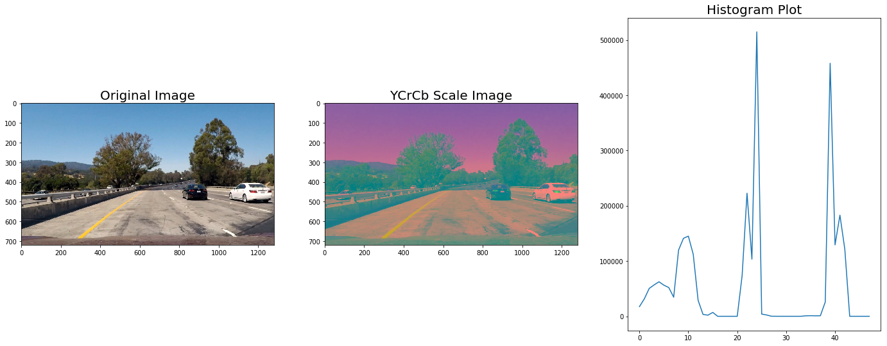
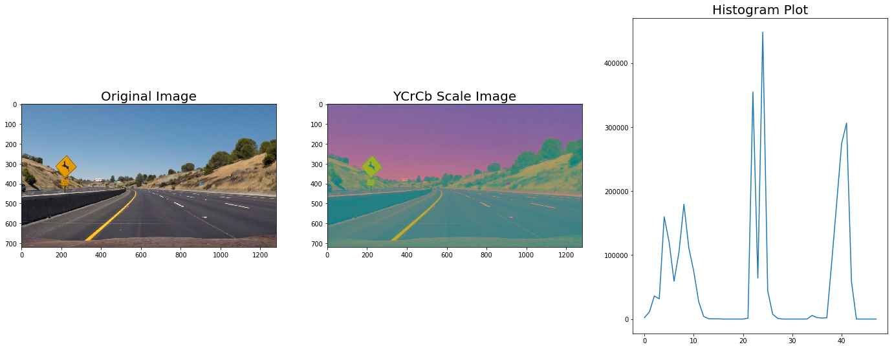
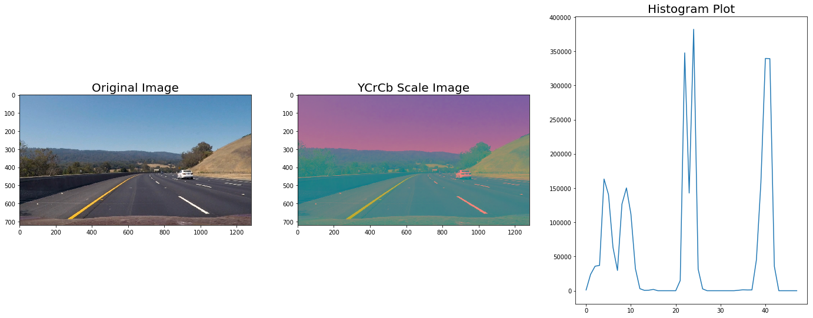
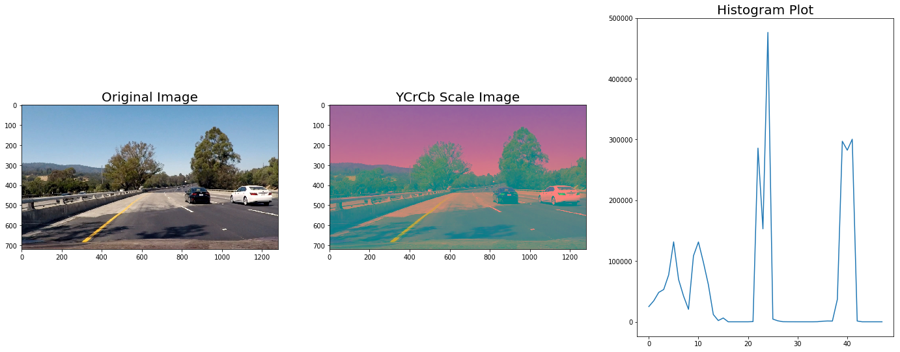
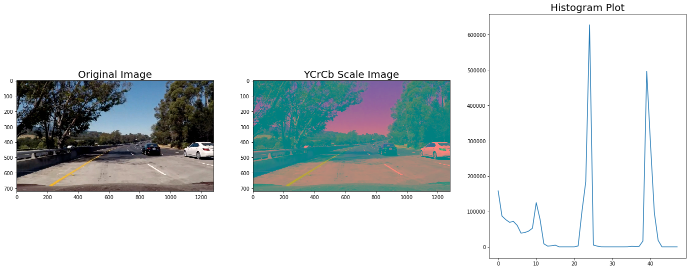
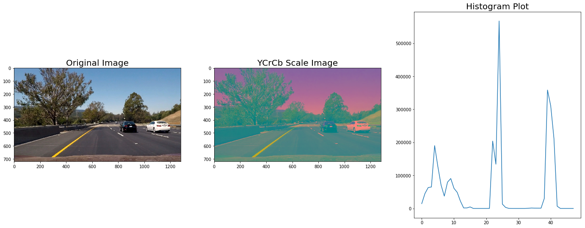

**Vehicle Detection Project**

The goals / steps of this project are the following:

* Perform a Histogram of Oriented Gradients (HOG) feature extraction on a labeled training set of images and train a classifier Linear SVM classifier
* Optionally, you can also apply a color transform and append binned color features, as well as histograms of color, to your HOG feature vector. 
* Note: for those first two steps don't forget to normalize your features and randomize a selection for training and testing.
* Implement a sliding-window technique and use your trained classifier to search for vehicles in images.
* Run your pipeline on a video stream (start with the test_video.mp4 and later implement on full project_video.mp4) and create a heat map of recurring detections frame by frame to reject outliers and follow detected vehicles.
* Estimate a bounding box for vehicles detected.


#### Image list in dataset 
Since the dataset that given has an near about same number of images. So we need not require any data augmentation for this case.


```python
#Total number of images present
print('Total number of car images',len(car_dataset_png))
print('Total number of non-car images',len(non_car_dataset_png))
```

    Total number of car images 8792
    Total number of non-car images 8968
    

### PipeLine step 1 :- Extract feature

* Color Coversion

Function Name :- color_conversion(image, color_space='RGB') - This function converts the image in the specified format. The format depends on the value of color_space argument.
Here for this pipeline i have used YCrCb color space here Y′ is the luma component and CB and CR are the blue-difference and red-difference chroma components.This channel are a practical approximation to color processing and perceptual uniformity, where the primary colors corresponding roughly to red, green and blue are processed into perceptually meaningful information. By doing this, subsequent image/video processing, transmission and storage can do operations and introduce errors in perceptually meaningful ways.


```python
test_images=glob.glob('./test_images/*')

for img in test_images:
    image = mpimg.imread(img)
    to_convert=np.copy(image)
    to_convert=color_conversion(to_convert,'YCrCb')
    f, (ax1, ax2) = plt.subplots(1, 2, figsize=(24, 9))
    ax2.imshow(to_convert)
    ax1.imshow(image)
    ax2.set_title('YCrCb Scale Image', fontsize=20)
    ax1.set_title('Original Image', fontsize=20)
```


* Spatial binning

Here we are extracting features directly from the image pixels that is passed as an argument to the image. Commonly the color space of the image which are also used to get other feature also, size of the image can be binned


```python
for img in test_images:
    image = mpimg.imread(img)
    to_convert=np.copy(image)
    to_convert=spatial_binning(to_convert,(32,32))
    print(to_convert.shape) # Converted to 1-D array of features
```

    (3072,)
    (3072,)
    (3072,)
    (3072,)
    (3072,)
    (3072,)
    

* Color_histogram

Here I am plotting the color histogram of the image that is passed as an argument to it.here we are taking one-dimensional histogram for each channel as we are taking only one feature into our consideration for that particular channel only.It is just another way of understanding the image. By looking at the histogram of an image, I an get intuition about contrast, brightness, intensity distribution etc of that image which is given as an argument to the function


```python
for img in test_images:
    image = mpimg.imread(img)
    to_convert=np.copy(image)
    converted_image=color_conversion(to_convert,'YCrCb')
    histogram_image=color_histogram(converted_image)
    f, (ax1, ax2,ax3) = plt.subplots(1, 3, figsize=(24, 9))
    ax2.imshow(converted_image)
    ax1.imshow(image)
    ax3.plot(histogram_image)
    ax3.set_title('Histogram Plot', fontsize=20)
    ax2.set_title('YCrCb Scale Image', fontsize=20)
    ax1.set_title('Original Image', fontsize=20)
```




















### HOG FEATURES

HOG feature is a feature descriptor that is a representation of an image or an image patch that simplifies the image by extracting useful information and throwing away extraneous information.The feature vector is not useful for the purpose of viewing the image. But, it is very useful for tasks like image recognition and object detection. I feel that the feature vector produced by these algorithms when fed into an image classification algorithms like Support Vector Machine (SVM) produce good results.
In this project we want the classifer to identify all the cars in an image and rest all the elements in the image we want it to be classified as non-car image. Since we are using the SVM model for the object detection. Lets consider the simpler case like identify a circle in an image i can also run the edge detector on the image , and easily tell if it is a circle or not by simply looking at the edge image alone, here edge information is “useful” and color information is not. In addition, the features also need to have discriminative power. Unlike this case in this project we need to identify a cars object in the image for this getting only the edge details is not enough, for a  good features extracted from an image should be able to tell the difference between car and other object like truck.

In the HOG feature descriptor, the distribution ( histograms ) of directions of gradients ( oriented gradients ) are used as features. Gradients ( x and y derivatives ) of an image are useful because the magnitude of gradients is large around edges and corners ( regions of abrupt intensity changes ) and we know that edges and corners pack in a lot more information about object shape than flat regions.


```python
for img in test_images:
    image = mpimg.imread(img)
    to_convert=np.copy(image)
    converted_image=color_conversion(to_convert,'YCrCb')
    feature_vector,hog_image=extract_hog_features(converted_image[:,:,1],9,8,16,True)
    f, (ax1, ax2,ax3) = plt.subplots(1, 3, figsize=(24, 9))
    ax2.imshow(converted_image)
    ax1.imshow(image)
    ax3.imshow(hog_image)
    ax3.set_title('HOG Image', fontsize=20)
    ax2.set_title('YCrCb Scale Image', fontsize=20)
    ax1.set_title('Original Image', fontsize=20)

## NOTE THE HOG FEATURE MIGHT NOT BE ABLE TO SEEN HERE, PLEASE ZOOM IN TO VISUALIZE IT #################################
```

    C:\Users\carol\Miniconda3\envs\carnd-term1\lib\site-packages\skimage\feature\_hog.py:119: skimage_deprecation: Default value of `block_norm`==`L1` is deprecated and will be changed to `L2-Hys` in v0.15
      'be changed to `L2-Hys` in v0.15', skimage_deprecation)
    


## Model Training 

I am using the SVM model to train my classifier. This model is supervised learning models with associated learning algorithms that analyze data used for classification and regression analysis. Given a set of training examples, each marked as belonging to one or the other of two categories, an SVM training algorithm builds a model that assigns new examples to one category or the other,making it a non-probabilistic binary linear classifier. I have used this model as for this case we have a set of the car images and non- car images and we have labels for all the images (setting the label for all the car images as 1 and all non-car images as 0). This model applies the statistics of support vectors, developed in the support vector machines algorithm, to categorize unlabeled data, and is one of the most widely used clustering algorithms.Classification of images can also be performed using SVMs, beacuse of this i have used this model to train my classifier.


```python
#Parameters to be passed
color_space='YCrCb'
spatial_size=(16, 16)
histogram_bins=16
orientation=9
pixels_per_cell=8
cell_per_block=2
hog_channel='ALL'
spatial_feature=True
histogram_feature=True
hog_feature=True
hog_vis=False

car_features = extract_feature(car_dataset_png,color_space=color_space
                                ,spatial_size=spatial_size
                                ,histogram_bins=histogram_bins
                                ,orientation=orientation
                                ,pixels_per_cell=pixels_per_cell
                                ,cell_per_block=cell_per_block
                                ,hog_channel=hog_channel
                                ,spatial_feature=spatial_feature
                                ,histogram_feature=histogram_feature
                                ,hog_feature=hog_feature
                                ,hog_vis=hog_vis)

non_car_features = extract_feature(non_car_dataset_png,color_space=color_space
                                ,spatial_size=spatial_size
                                ,histogram_bins=histogram_bins
                                ,orientation=orientation
                                ,pixels_per_cell=pixels_per_cell
                                ,cell_per_block=cell_per_block
                                ,hog_channel=hog_channel
                                ,spatial_feature=spatial_feature
                                ,histogram_feature=histogram_feature
                                ,hog_feature=hog_feature
                                ,hog_vis=hog_vis)

X = np.vstack((car_features, non_car_features)).astype(np.float64)
#normalizing the features that was extracted
X_scaler = StandardScaler().fit(X)
scaled_X = X_scaler.transform(X)
#Getting labels, For Car images we are setting label to 1 (an array) and for not a car object we are setting it to 0
Y = np.hstack((np.ones(len(car_features)), np.zeros(len(non_car_features))))

X_train,y_train,X_test,y_test=data_split(car_features,non_car_features,scaled_X,Y,0.2)
print('Using:',orientation,'orientations',pixels_per_cell,
               'pixels per cell and', cell_per_block,'cells per block')
print('Feature vector length:', len(X_train[0]))
print('X_train shape:', X_train.shape)
print(X_train.shape[0], 'train samples')
print(X_train.shape, 'X_train.shape')
print(y_train.shape, 'y_train.shape')
print(X_test.shape, 'X_test')
print(y_test.shape, 'y_test shape')
print(scaled_X.shape, 'scaled_X shape')
print(Y.shape, 'y  shape')
t=time.time()
svc=svm_model_train(X_train,y_train)
t2 = time.time()
print(round(t2-t, 2), 'Seconds to train SVC...')
print('Test Accuracy of SVC = ', round(svc.score(X_test, y_test), 4))

```

    C:\Users\carol\Miniconda3\envs\carnd-term1\lib\site-packages\skimage\feature\_hog.py:119: skimage_deprecation: Default value of `block_norm`==`L1` is deprecated and will be changed to `L2-Hys` in v0.15
      'be changed to `L2-Hys` in v0.15', skimage_deprecation)
    

    Using: 9 orientations 8 pixels per cell and 2 cells per block
    Feature vector length: 6108
    X_train shape: (14209, 6108)
    14209 train samples
    (14209, 6108) X_train.shape
    (14209,) y_train.shape
    (3551, 6108) X_test
    (3551,) y_test shape
    (17760, 6108) scaled_X shape
    (17760,) y  shape
    10.16 Seconds to train SVC...
    Test Accuracy of SVC =  0.9521
    

## Saving the data to the pickel file


```python
# Saving the data to the pickel file
import pickle
save_data(svc,X_scaler)
```

    Saving data to pickle file...
    Data cached in pickle file.
    

### Testing the model and find_car funtion in test_images


```python
svc            = svc
X_scaler       = X_scaler
color_space    = 'YCrCb'
spatial_size   = (16, 16)
histogram_bins = 16
orient         = 9
pixels_per_cell = 8
cell_per_block = 2
hog_channel       = 'ALL'
spatial_feature   = True
hist_feature      = True
hog_feature       = True
cells_per_step = 1
scales         = [1, 1.5, 2, 2.5, 4]
window         = 64
y_start_stops  = [[380, 460], [380, 560], [380, 620], [380, 680], [350, 700]]

for img in test_images:
    image = mpimg.imread(img)
    hot_windows=find_cars(image,svc=svc , 
                X_scaler=X_scaler,
                color_space=color_space,
                spatial_size= spatial_size,
                histogram_bins= histogram_bins,
                orient = orient,
                pixels_per_cell = pixels_per_cell,
                cell_per_block = cell_per_block,
                hog_channel= hog_channel,
                spatial_feature= spatial_feature,
                hist_feature= hist_feature,
                hog_feature= hog_feature,
                cells_per_step= cells_per_step,
                scales=scales,
                window=window,
                y_start_stops= y_start_stops)
    draw_image  = np.copy(image)
    draw_image  = draw_boxes(draw_image, hot_windows, color=(0, 0, 255), thick=6)
    f, (ax1, ax2) = plt.subplots(1, 2, figsize=(24, 9))
    ax2.imshow(draw_image)
    ax1.imshow(image)
    ax2.set_title('Car Detected image', fontsize=20)
    ax1.set_title('Original Image', fontsize=20)

```

    C:\Users\carol\Miniconda3\envs\carnd-term1\lib\site-packages\skimage\feature\_hog.py:119: skimage_deprecation: Default value of `block_norm`==`L1` is deprecated and will be changed to `L2-Hys` in v0.15
      'be changed to `L2-Hys` in v0.15', skimage_deprecation)
    


As from the above image we can see that there are some false positive that is been detected, i am planning to remove it by using the heatmap method. Heatmap are the graphical representation of data where the individual values contained in a matrix are represented as colors

# Heat Maps


```python
from scipy.ndimage.measurements import label
for img in test_images:
    image = mpimg.imread(img)
    hot_windows=find_cars(image,svc=svc , 
                X_scaler=X_scaler,
                color_space=color_space,
                spatial_size= spatial_size,
                histogram_bins= histogram_bins,
                orient = orient,
                pixels_per_cell = pixels_per_cell,
                cell_per_block = cell_per_block,
                hog_channel= hog_channel,
                spatial_feature= spatial_feature,
                hist_feature= hist_feature,
                hog_feature= hog_feature,
                cells_per_step= cells_per_step,
                scales=scales,
                window=window,
                y_start_stops= y_start_stops)
    draw_image  = np.copy(image)
    draw_image  = draw_boxes(draw_image, hot_windows, color=(0, 0, 255), thick=6)
    f, (ax1, ax2,ax3) = plt.subplots(1, 3, figsize=(24, 9))
    heat = np.zeros_like(image[:,:,0]).astype(np.float)
    heat = add_heat(heat,hot_windows)
    heat = apply_threshold(heat,2)
    heatmap_in_rgb=get_heatmap_image(heat)
    ax2.imshow(draw_image)
    ax1.imshow(image)
    ax3.imshow(heatmap_in_rgb)
    ax2.set_title('Car Detected image', fontsize=20)
    ax1.set_title('Original Image', fontsize=20)
    ax3.set_title('Heatmap Image', fontsize=20)
 


```

    C:\Users\carol\Miniconda3\envs\carnd-term1\lib\site-packages\skimage\feature\_hog.py:119: skimage_deprecation: Default value of `block_norm`==`L1` is deprecated and will be changed to `L2-Hys` in v0.15
      'be changed to `L2-Hys` in v0.15', skimage_deprecation)
    C:\Users\carol\Miniconda3\envs\carnd-term1\lib\site-packages\ipykernel_launcher.py:3: RuntimeWarning: invalid value encountered in true_divide
      This is separate from the ipykernel package so we can avoid doing imports until
    C:\Users\carol\Miniconda3\envs\carnd-term1\lib\site-packages\matplotlib\colors.py:494: RuntimeWarning: invalid value encountered in less
      cbook._putmask(xa, xa < 0.0, -1)
    


Clearly after the heat map, test_images are properly detect with all the box, what is left is to draw the box around these heatmaps.One of the nice features of the scipy.ndimage.measurements.label function is that it can process 3d arrays giving labels in x,y,z spaces. Thus when using the array of heat map history as input, it labels connections in x,y,z. If a returned label box is not represented in at least 3 (heat map history max - 2) z planes then it is rejected as a false positive. The result is that a vehicle is tracked over the heat map history kept
Below code snapshot is used to run on the video.


```python
from moviepy.editor import VideoFileClip
from moviepy.editor import VideoFileClip
from IPython.display import HTML

write_output = 'project_video_out.mp4'
clip1 = VideoFileClip("project_video.mp4")#.subclip(5,12)
write_clip = clip1.fl_image(final_processing)
%time write_clip.write_videofile(write_output, audio=False)
```

    [MoviePy] >>>> Building video project_video_out.mp4
    [MoviePy] Writing video project_video_out.mp4
    

    100%|█████████████████████████████████████████████████████████████████████████████▉| 1260/1261 [19:28<00:00,  1.15it/s]
    

    [MoviePy] Done.
    [MoviePy] >>>> Video ready: project_video_out.mp4 
    
    Wall time: 19min 30s
    

### Discussion

The pipeline is able to correctly lable cars areas on a video frames. 

During the course of testing i found the my CPU was under utilization as i was processing all the images of the CPU in a serial manner.The algorithm might fail in case of difficult light conditions, which could be partly resolved by the classifier improvement.It is possible to improve the classifier by additional data augmentation, hard negative mining, classifier parameters tuning etc.The algorithm may have some problems in case of car overlaps another. To resolve this problem one may introduce long term memory of car position and a kind of predictive algorithm which can predict where occluded car can be and where it is worth to look for it.Maybe we could get the output probabilities of the classifier (instead of a binary output) to fill in a continuous heatmap. This way, the final tracking box would be moving softer. We could for example, track the position of the center of the blob instead of the maximum and minimum of the thresholded heatmap, in order to make softer the movement of the final box surrounding the car.

I think convolutional neural network like implementing YOLO approach may show more robustness and speed. As it could be easily accelerated via GPU. Also it may let to locate cars in just one try. For example we may ask CNN to calculate number of cars in the image. And by activated neurons locate positions of the cars. In that case SVM approach may help to generate additional samples for CNN training


